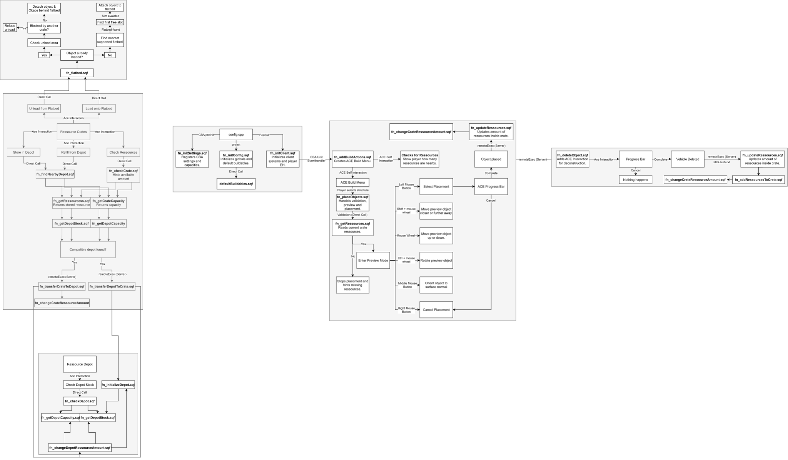

# Build and Ressources
## Requirements
- CBA_A3
- ACE3

## Mission Maker Setup
Place one or more ressource crates in Eden or through Zeus:
- RessourceCrate_Concrete
- RessourceCrate_Wood
- RessourceCrate_Sand
- RessourceCrate_Metal

When having an Fortify Tool in the inventory the player will have the build list.

The build list can be modified by following the instruction:

In your mission folder create a initServer.sqf and a folder named BuildAndRessources. 
Inside this folder create a file named buildables.sqf.
The structure should look like this:

Mission.Map
- initServer.sqf
- BuildAndRessources
  - buildables.sqf

In the buildables.sqf you can write your new buildables that will show up in the game.
Here is a quick example. The first entry is the classname of the object. 
The second entry is the cost [Concrete, Wood, Sand, Metal].
Third Entry is the name and fourth is the build time.

[
   ["Land_BagFence_Long_F", [0,0,20,0], "Sandbag (Long)", "Fortifications", 5],
   ["Land_HBarrier_5_F", [0,0,80,0], "H-Barrier", "H-Barriers", 12]
]

In the initServer.sqf your add:

BuildAndRessources_classnameList = call compile preprocessFileLineNumbers "BuildAndRessources\buildables.sqf";
publicVariable "BuildAndRessources_classnameList";

	
Ressource inside ressource crates can be checked via ACE Interaction also enables to load them onto supported flatbeds.

## Build Controls
- Mouse wheel: Move the preview object up or down.
- Ctrl + mouse wheel: Rotate the preview object.
- Shift + mouse wheel: Move the preview object closer or farther away.

## Supported Flatbeds
The mod supports vanilla HEMTT flatbeds and optionally supports UK3CB BAF MAN HX58 cargo vehicles when UK3CB is loaded.

## Code Architecture

The following diagram shows how the main systems and functions of BuildAndRessources interact with each other. It is still work in progress tho.

